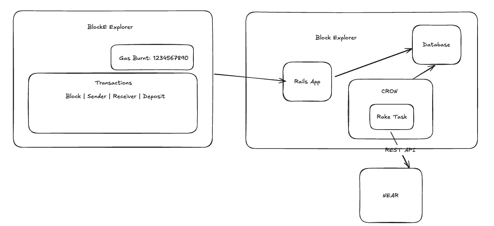
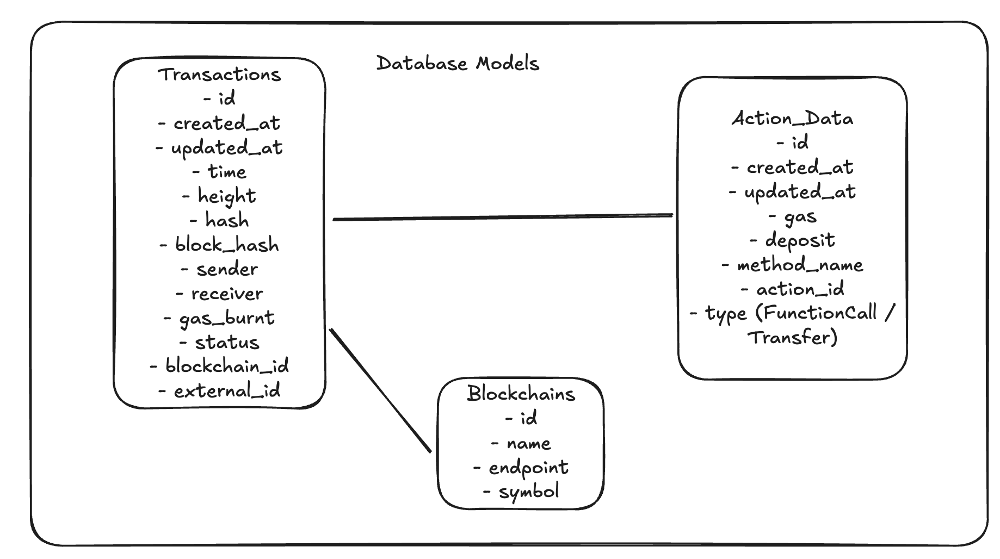

# Block Explorer App

The Block Explorer App is an application that shows all the transactions from the NEAR blockchain.



The application consists in a Rails Application that presents transaction data from the database.
The database is populated by a task that queries the data from the API.

## Requirements:

- [x] A root index page with a list of transfers with the following fields: sender, receiver, deposit
- [x] A section on the page that shows the average gas burnt for all transactions.
- [x] The app should show the historical transactions it was able to fetch already even if they are no longer returned by the API.
- [x] Although we are using only NEAR in this example, it’s possible new chains will be added later.

## Decisions and Assumptions

To be able to show historical data, I'm saving the data in the database and showing to the user from the database.

I implemented a rake task scheduled to run every minute.
- The time is an assumption and can be adjusted to better support users.
- I had issues with my Ruby version to run locally the task from the cronjob.
- In production I would probably be using something different than the whenever gem, something like Kubernetes cron jobs or Sidekiq cron.

All models were generated using rails scaffold so views for CRUD the models are available but not exposed in the UI, it was mainly used to speed up the process of developing the application.

To improve the application I would be checking the ID or height to avoid querying the database for every single record returning in the API.
Also, ideally, I would be able to pass a parameter in the API to get the most recent data to be faster in the ingestion of the data on the application side.

Adding cursor-based pagination on the UI is another improvement which I didn't have time to look into.

## Setup

Create .env file for the NEAR_API_KEY

```sh
cp env-example .env
```

### Database

Setup the database, it will create the database, run migrations and seed the database with the NEAR data.

```sh
bin/rails db:setup
```

## Run the Application

To populate the data from the API run:

```sh
bin/rake fetch_transactions:near
```

To start the application:

```sh
bin/dev
```

## Access the application

Go to http://localhost:3000


## Database Modeling



The database model conists of three tables:
- Blockchain:
  - The list of all blockchains so we can add new blockchains in the future
- Transactions:
  - All transactions per blockchain
  - It stores the external_id for future reference
- Actions:
  - Actions per transaction
  - Currently supporting types Transfer and FunctionCall

I thought about creating a user model and maybe adding a sign in flow to access the data as I was considering the API_KEY used to query the API would be per user.
But it seems it's actually one API_KEY per blockchain.
